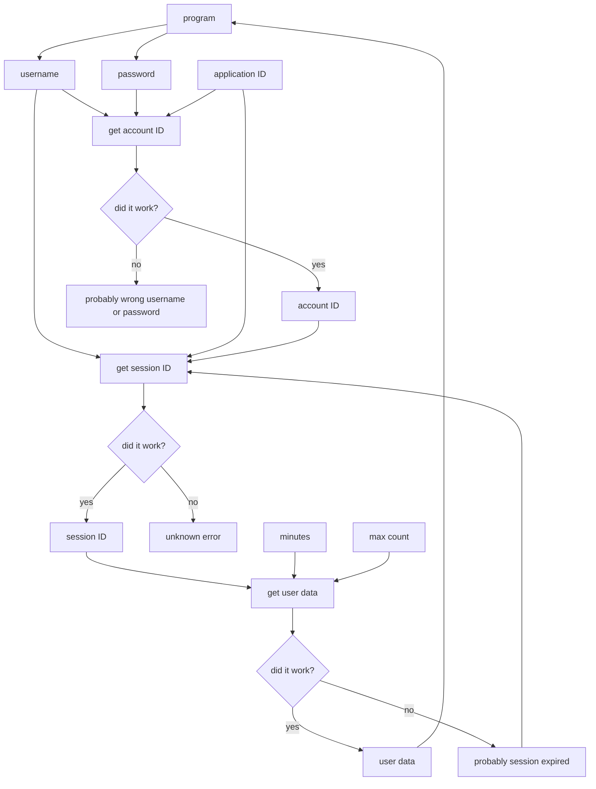

# About

## What is this repository?

I made this repository to fill the missing documentation of the Dexcom Share API. This API only needs a username, password, and application ID to start. It will create a session and use that session to get glucose readings and data. I have created [dexcom for Dart](https://pub.dev/packages/dexcom) for Dart and Flutter programs, and potentially more platforms to come. (Looking for Python? [pydexcom](https://github.com/gagebenne/pydexcom) is where I got all this from.) If you have any questions you can head to [my Discord server](https://discord.gg/rpsqjuZDJF).

This section is for documentation on the Dexcom Share API in general. **[Looking for the Dart package `dexcom`'s documentation?](#dexcom-for-dart)**

## What is the Dexcom Share API?

Dexcom is a CGM company. They produce CGMs, or continuous glucose monitors. These machines tell you your estimated bloodsugar without having to use a manual meter.

The Dexcom Share API uses a URL to get your account ID, set up a session, then retrieve your glucose values. This makes it worlds easier to get your readings, as normally, you would have to set up a developer account, make an app, use OAuth2 to authorize said app (which requires a website), and then constantly use a refresh token to get new data. This is very tedious to do. So, this Dexcom Share API uses a direct URL to get your glucose data.

## What is the Dexcom Web API, and how is it different from the Dexcom Share API?

### Summary

The Dexcom Web API is Dexcom's official API. It uses OAuth 2.0. among other means of authentication.

The Dexcom Share API is an unofficial API found by the community that only requires a simple Dexcom username and password. It's designed to only fetch the latest glucose data.

### Comparison

| Feature | Dexcom Share API | Dexcom Web API v3 |
|-----------|-----------|-----------|
| Features | Get real-time blood glucose levels | Get retrospective glucose and data |
| Data | Just glucose levels | Past glucose levels, calibration data, and lots more |
| Timing | Instant | 1 hour delay in the US, 3 hour delay outside of the US |
| Compatibility | Sensors: Dexcom G4+ | Sensors: Dexcom G6+ |
| Documentation | Unofficially documented through projects like [pydexcom](https://github.com/gagebenne/pydexcom), [dexcom-share-api](https://github.com/aud/dexcom-share-api), and my Dexcom project ([dexcom](https://github.com/Calebh101/dexcom)) | Officially documented on Dexcom's website |
| Authentication | Username and password are sent with https requests | Apps are authorized by the client using OAuth 2.0 |

**Note**: Take the compatibility section with a grain of salt.

While the Dexcom Share API can only fetch real-time blood glucose levels with no way to control range and other things, the Dexcom Web API has a lot of (officially provided) features:

- Alerts
- Calibrations
- Data ranges
- Device information
- Glucose values
- Events

However, keep in mind: **the Dexcom Web API has a one hour delay in the US and a three hour delay outside of the US**. This is due to FDA stuff with Dexcom. So you may have to mix the two in your app.

### Which one should I use?

- If you don't want to go through Dexcom's app verification process (such as submitting your app to Dexcom for them to let you publish it): **use the Dexcom Share API**.
- If you want an officially documented and supported API: **use the Dexcom Web API**.
- If you want literally anything more than just the latest glucose data: **use the Dexcom Web API**.
- If you're using this for a personal use case: **use the Dexcom Share API**.
- If you want glucose data from more than 24 hours in the past: **use the Dexcom Web API**.
- If you want to specify a time range for the glucose data: **use the Dexcom Web API**.
- Anything else: If you're publishing your app, I would generally recommend to **use the Dexcom Web API**, as it is officially supported and documented by Dexcom.

# How it Works

## Overview

There is no documentation on this that I could find, so I'm going to make my own.
Basically, your program will first get the account ID of the user. Then it uses the account ID to create a session and get the session ID. It then uses the session ID to get the glucose readings. If the glucose readings fail, this may be because of an expired session, so you will need to get the session ID again.

Here are the application IDs, base URLs, and endpoints that the program will use to authenticate and retrieve data. I have already provided application IDs (from [pydexcom](https://github.com/gagebenne/pydexcom)) for you.

```dart
"appId": {
    "us": "d89443d2-327c-4a6f-89e5-496bbb0317db",
    "ous": "d89443d2-327c-4a6f-89e5-496bbb0317db",
    "jp": "d8665ade-9673-4e27-9ff6-92db4ce13d13"
},
"baseUrl": {
    "us": "https://share2.dexcom.com/ShareWebServices/Services",
    "ous": "https://shareous1.dexcom.com/ShareWebServices/Services",
    "jp": "https://share.dexcom.jp/ShareWebServices/Services"
},
"endpoint": {
    "account": "General/AuthenticatePublisherAccount",
    "session": "General/LoginPublisherAccountById",
    "data": "Publisher/ReadPublisherLatestGlucoseValues"
}
```

## Account ID
First, you need to get the account ID. This is really simple, as you just need to send a username, a password, and an application id to the server. Depending on where the user is (in the US, out of the US, or Japan), you will send the request to one of these URLs:

- US: https://share2.dexcom.com/ShareWebServices/Services/General/AuthenticatePublisherAccount
- Out of US: https://shareous1.dexcom.com/ShareWebServices/Services/General/AuthenticatePublisherAccount
- Japan: https://share.dexcom.jp/ShareWebServices/Services/General/AuthenticatePublisherAccount

Then, send these as the headers: `{"Content-Type": "application/json"}`

And send this as the body:
```dart
{
    "accountName": "username",
    "password": "password",
    "applicationId": "appId",
}
```

Your response will be a UUID in plaintext. For some reason, the API does return the UUID with surrounding quotes, so you'll need to parse those out.

For example: you got a response: `"8597cbce-1c66-4655-bf7d-a7e070638b80"`

Your code would be:
```javascript
const accountId = (await response.text() /* or however you get the body */).replaceAll("\"", "");
```

And your result will be: `8597cbce-1c66-4655-bf7d-a7e070638b80`.

Great, now you should have an account ID! This is just step one of the process. Sigh...

## Session ID

Next, you need a session ID. This is temporary, so you will need to remake this every once in a while. I'll tell you how to do that efficiently in the next section.

In order to get a session ID, you need to send a username, a password again, and the application ID to the server, again. Depending on where the user is (in the US, out of the US, or Japan), you will send the request to one of these URLs:

- US: https://share2.dexcom.com/ShareWebServices/Services/General/LoginPublisherAccountById
- Out of US: https://shareous1.dexcom.com/ShareWebServices/Services/General/LoginPublisherAccountById
- Japan: https://share.dexcom.jp/ShareWebServices/Services/General/LoginPublisherAccountById

Send these as the headers: `{"Content-Type": "application/json"}`

And send this as the body:
```json
{
    "accountId": "accountId", // not username, this is where we put the account ID we got in the previous step.
    "password": "password",
    "applicationId": "appId", // based on the region, see the data above in the `appId` section
}
```

It is returned in the exact same way as stated in the account ID section.

Now you have a session ID! We can use the session ID to get their glucose data.

## Glucose Data

So now you have your session ID. Now, let's use that to retrieve data. To get this, you need a session ID, how many pieces of data you want, and how many minutes you want. Here are the URLs:

- US: https://share2.dexcom.com/ShareWebServices/Services/Publisher/ReadPublisherLatestGlucoseValues
- Out of US: https://shareous1.dexcom.com/ShareWebServices/Services/Publisher/ReadPublisherLatestGlucoseValues
- Japan: https://share.dexcom.jp/ShareWebServices/Services/Publisher/ReadPublisherLatestGlucoseValues

Send these as the headers: `{"Content-Type": "application/json"}`

And send this as the body:

```json
{
    "sessionId": "sessionId",
    "minutes": 60,
    "maxCount": 2,
}
```

You will want to program your app so that if it fails, it will create a new session and try again.

Your response will look like this:

```json
[
    {
        "WT": Date(1731645818222),
        "ST": Date(1731645818222),
        "DT": Date(1731645818222-0500),
        "Value": 155,
        "Trend": "Flat"
    },
    {
        "WT": Date(1731645518663),
        "ST": Date(1731645518663),
        "DT": Date(1731645518663-0500),
        "Value": 155,
        "Trend": "FortyFiveDown"
    }
]
```
As you can see, it's an array of 2 items, because that's how many I wanted the program to get. The top one (item 0) is the most recent. The WT and ST both tell you when the value was taken in UTC. DT tell you when the value was taken in the local time zone (which, in this example, is EST). WT, ST, and DT are recorded as milliseconds since Unix epoch. Value is the actual glucose value taken. The trend is the arrow direction. The trend can be:

- Flat: steady
- FortyFiveDown: slowly falling (-1/minute)
- FortyFiveUp: slowly rising (+1/minute)
- SingleDown: falling (-2/minute)
- SingleUp: rising (+2/minute)
- DoubleDown: quickly falling (-3/minute)
- DoubleUp: quickly rising (+3/minute)
- None: no trend
- NonComputable: the graph is too wonky for Dexcom to know which way the glucose levels are going. You might be able to try to compute this yourself if you wanted to.
- RateOutOfRange: the bloodsugar is rising or falling too fast to be computable. This typically happens during sensor errors, where the bloodsugar will randomly drop 50 or more before the sensor goes out.

So, now you are ready to start using the Dexcom API in your app! I created [dexcom](https://pub.dev/packages/dexcom), a package for Dart, and there's [pydexcom](https://github.com/gagebenne/pydexcom) for Python.

# Handling errors

In a production environment, you will encounter HTTP errors while making requests.

- While getting account ID: If you have a non-200 status code, then the account credentials are most likely incorrect.
- While getting session ID: If you have a non-200 status code, then you should look into your code.
- While getting glucose values: If you have a non-200 status code, then the session is expired, and you should re-fetch the session ID.

# Diagram of the Process



# dexcom for Dart

`dexcom` for Dart is available on [pub.dev](https://pub.dev/packages/dexcom).

dexcom for Dart allows you to use the Dexcom Share API to get your Dexcom CGM data, or anybody else's, to run your application. Includes time (in milliseconds since Unix epoch), reading, and trend. Use only your email and password to have access to all your glucose data! The username can be an email, username, or phone.

## Important Information

WARNING: This package fetches, processes, and outputs real-time blood glucose levels. DO NOT USE/ADVERTISE THIS FOR IMPORTANT MEDICAL TREATMENT DECISIONS. WE ARE NOT RESPONSIBLE FOR ANY MEDICAL INCIDENTS/EMERGENCIES CREATED/ELEVATED BECAUSE OF THIS PROGRAM OR ANY PROGRAMS USING IT. USE AT YOUR OWN RISK, OR AT THE RISK OF ANY CLIENTS USING THIS APP.

While the Dexcom Share API can only fetch real-time blood glucose levels with no way to control range and other things, the Dexcom Web API has a lot of (officially provided) features:

- Alerts
- Calibrations
- Data ranges
- Device information
- Glucose values
- Events

The main downside to the Web API, along with other things: **it has a data delay of one to three hours**, which is not preferable for some apps.

This package documents and supports the Dexcom Share API, not the Web API.

## Usage

### Verifying:
```dart
String username = "username";
String password = "password";
String region = "region";
var dexcom = Dexcom({username: username, password: username, region: region, debug: bool, minutes: int, maxCount: int, appIds: DexcomAppIds});
List<dynamic>? response;
```

First, let's go over the parameters:
- username: username (email, password, or phone number)
- password: password
- region: region (set automatically if not set)
- debug: shows extra logs
- minutes: default for every function if not explicitly set
- maxCount: default for every function if not explicitly set
- appIds: DexcomAppIds

What is DexcomAppIds?

DexcomAppIds is an object that stores the application IDs needed to send requests. There's a US option, an out-of US (OUS) option, and a Japan (JP) option. US and OUS can sometimes be used interchangeably, so you only have to specify one if you don't want to specify both. The Japanese option is separately managed. If your program is used in a region that you have not set an application ID for, then the Dexcom object will error. There is a default set, in case you don't have your own. (Which is common since this uses an undocumented API.)
Example:

```dart
DexcomAppIds(us: "your-us-app-id", ous: "your-ous-app-id", jp: "your-jp-app-id");
```

```dart
DexcomVerificationResult verificationResult = dexcom.verify();
```

This logs the user into their account to check if the entered credentials are valid. This will return a `DexcomVerificationResult` object.

### Retrieving data:
```dart
String username = "username";
String password = "password";
var dexcom = Dexcom(username, password);
List<dynamic>? response;
try {
    response = await dexcom.getGlucoseReadings([optional: minutes, maxCount]);
    print("Read data with dexcom: $dexcom");
} catch (e) {
    print("Unable to read data with dexcom: $e");
}

if (response != null) {
    print("Data received: $response");
    return response;
} else {
    print("Data is null");
}
```

This actually retrieves the glucose readings from the user. If it fails, it automatically tries to recreate the session. This is sample data (actually taken from a real reading):

```json
[
  {
    "WT": "2022-11-22T17:29:54.000Z", 
    "ST": "2022-11-22T17:29:54.000Z",      // system time
    "DT": "2022-11-22T11:29:54.000-06:00", // display time
    "Value": 162, 
    "Trend": "FortyFiveUp"
  },
  {
    "WT": "2022-11-22T17:24:54.000Z", 
    "ST": "2022-11-22T17:24:54.000Z",
    "DT": "2022-11-22T11:24:54.000-06:00", 
    "Value": 159, 
    "Trend": "FortyFiveUp"
  }
]
```

This is how the package will return it:

```dart
[
    DexcomReading(
        systemTime: DateTime(2022-11-22T17:29:54.000Z),
        displayTime: DateTime(2022-11-22T17:29:54.000Z),
        value: 162,
        trend: DexcomTrend.fortyFiveUp,
    ),
    DexcomReading(
        systemTime: DateTime(2022-11-22T17:29:54.000Z),
        displayTime: DateTime(2022-11-22T17:29:54.000Z),
        value: 159,
        trend: DexcomTrend.fortyFiveUp,
    ),
]
```

As you can see, it's an array of 2 items, because that's how many I wanted the program to get. The top one (item 0) is the most recent. From the [Dexcom Web API documentation](https://developer.dexcom.com/docs/dexcomv3/endpoint-overview/#time):

> "systemTime is the UTC time according to the device, whereas displayTime is the time being shown on the device to the user. Depending on the device, this time may be user-configurable, and can therefore change its offset relative to systemTime. Note that systemTime is not 'true' UTC time because of drift and/or user manipulation of the devices' clock." 

Value is the actual glucose value taken. The trend is the arrow direction. The trend can be:
- Flat: steady
- FortyFiveDown: slowly falling (-1/minute)
- FortyFiveUp: slowly rising (+1/minute)
- SingleDown: falling (-2/minute)
- SingleUp: rising (+2/minute)
- DoubleDown: quickly falling (-3/minute)
- DoubleUp: quickly rising (+3/minute)
- None: no trend
- NonComputable: the graph is too wonky for Dexcom to know which way the glucose levels are going. You might be able to try to compute it yourself if you wanted to.
- RateOutOfRange: the bloodsugar is rising or falling too fast to be computable. This typically happens during sensor errors, where the bloodsugar will randomly drop 50 or more before when the sensor malfunctions.

The program will return DexcomTrend.flat, DexcomTrend.fortyFiveDown, etc. You can convert it to a string with `trend.convert()`.

### Listening:

First, make a new DexcomStreamProvider object:

```dart
DexcomStreamProvider provider = DexcomStreamProvider(object, oneAtATime: bool, debug: bool, interval: int, buffer: int);
```

Parameters:
- `object`: The Dexcom object to listen to.
- `maxCount`: How many pieces of data should be sent with each new incoming data. This is recommended to be a low number.
- `debug`: Show debug logs.
- `buffer`: How long the function should wait after the timer hits the interval before fetching. This is used to give the client's Dexcom time to upload its reading.

```dart
provider.listen(
    onData: (data) => print('Stream received: $data'),
    onError: (error) => print('Stream errored: $error'),
    onTimerChange: (time) => print("Stream timer: $time"),
    onRefresh: () => print("Stream refresh"),
    onRefreshEnd: (time) => print("Stream refresh ended after ${time.inMilliseconds}ms"),
    cancelOnError: false, // True if the listener should cancel when an error is received.
);
```

This will call `onData` when new data is received, `onError` when it throws an error, and `onTimerChange` when the timer is changed, which is normally every second.

Function parameters:

- `onData`: Called when new Dexcom data is received. This also includes manual/automatic refreshes.
- `onError`: Called when the stream errors.
- `onTimerChange`: Called when the timer is changed, which is every second; but sometimes it can slow down when refreshing.
- `onRefresh`: Called when the provider starts refreshing.
- `onRefreshEnd`: Called when the provider is done refreshing. This also includes how long it took to refresh, in a `Duration` object.

To refresh the readings early:

```dart
provider.refresh();
```

This internally triggers a refresh.

## Additional Information

This package was based off of pydexcom for Python. I was able to port it to Flutter (from the start), and then eventually Dart (version `0.1.2`).

If you have any questions or need support you can head to [my Discord server](https://discord.gg/rpsqjuZDJF).
