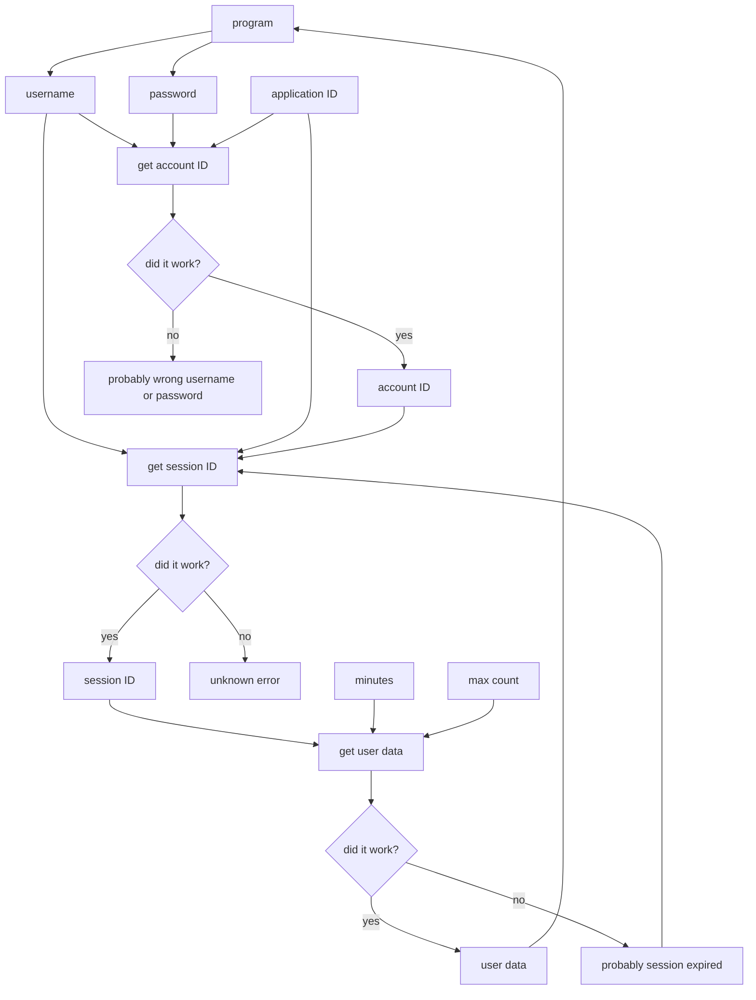

# About
## What is this repository?

I made this repository to fill the missing documentation of the Dexcom Share API. This API only needs a username, password, and application ID to start. It will create a session and use that session to get glucose readings and data. I have created [dexcom for Dart](https://pub.dev/packages/dexcom) for Dart and Flutter programs, and potentially more platforms to come. (Looking for Python? [pydexcom](https://github.com/gagebenne/pydexcom) is where I got all this from.) Reach out if you have any questions.

## What is the Dexcom Share API?

Dexcom is a CGM company. They produce CGMs, or continuous glucose monitors. These machines tell you your estimated bloodsugar without having to use a manual meter.

The Dexcom Share API uses a URL to get your account ID, set up a session, then retrieve your glucose values. This makes it worlds easier to get your readings, as normally, you would have to set up a developer account, make an app, use OAuth2 to authorize said app (which requires a website), and then constantly use a refresh token to get new data. This is very tedious to do. So, this Dexcom Share API uses a direct URL to get your glucose data.

# How it Works
## Overview

There is no documentation on this that I could find, so I'm going to make my own.
Basically, your program will first get the account ID of the user. Then it uses the account ID to create a session and get the session ID. It then uses the session ID to get the glucose readings. If the glucose readings fail, this may be because of an expired session, so you will need to get the session ID again.

Here are the application IDs, base URLs, and endpoints that the program will use to authenticate and retrieve data. I have already provided application IDs (from [pydexcom](https://github.com/gagebenne/pydexcom)) for you.
```dart
"appId": {
    "us": "d89443d2-327c-4a6f-89e5-496bbb0317db",
    "ous": "d89443d2-327c-4a6f-89e5-496bbb0317db",
    "jp": "d8665ade-9673-4e27-9ff6-92db4ce13d13"
},
"baseUrl": {
    "us": "https://share2.dexcom.com/ShareWebServices/Services",
    "ous": "https://shareous1.dexcom.com/ShareWebServices/Services",
    "jp": "https://share.dexcom.jp/ShareWebServices/Services"
},
  "endpoint": {
    "account": "General/AuthenticatePublisherAccount",
    "session": "General/LoginPublisherAccountById",
    "data": "Publisher/ReadPublisherLatestGlucoseValues"
}
```

## Account ID
First, you need to get the account ID. This is really simple, as you just need to send a username, a password, and an application id to the server. Depending on where the user is (in the US, out of the US, or Japan), you will send the request to one of these URLs:

- US: https://share2.dexcom.com/ShareWebServices/Services/General/AuthenticatePublisherAccount
- Out of US: https://shareous1.dexcom.com/ShareWebServices/Services/General/AuthenticatePublisherAccount
- Japan: https://share.dexcom.jp/ShareWebServices/Services/General/AuthenticatePublisherAccount

Then, send these as the headers: `{'Content-Type': 'application/json'}`

And send this as the body:
```json
{
    'accountName': username,
    'password': password,
    'applicationId': appId, // based on the region, see the data above in the `appId` section
}
```

Great, now you should have an account ID! This is just step one of the process. Sigh...

## Session ID

Next, you need a session ID. This is temporary, so you will need to remake this every once in a while. I'll tell you how to do that efficiently in the next section.

In order to get a session ID, you need to send a username, a password, and an application id to the server. Depending on where the user is (in the US, out of the US, or Japan), you will send the request to one of these URLs:

- US: https://share2.dexcom.com/ShareWebServices/Services/General/LoginPublisherAccountById
- Out of US: https://shareous1.dexcom.com/ShareWebServices/Services/General/LoginPublisherAccountById
- Japan: https://share.dexcom.jp/ShareWebServices/Services/General/LoginPublisherAccountById

Send these as the headers: `{'Content-Type': 'application/json'}`

And send this as the body:
```json
{
    'accountId': accountId, // not username, this is where we put the account ID we got in the previous step.
    'password': password,
    'applicationId': appId, // based on the region, see the data above in the `appId` section
}
```

Now you have a session ID! We can use the session ID to get their glucose data.

## Glucose Data

So now you have your session ID. Now, let's use that to retrieve data. To get this, you need a session ID, how many pieces of data you want, and how many minutes you want. Here are the URLs:

- US: https://share2.dexcom.com/ShareWebServices/Services/Publisher/ReadPublisherLatestGlucoseValues
- Out of US: https://shareous1.dexcom.com/ShareWebServices/Services/Publisher/ReadPublisherLatestGlucoseValues
- Japan: https://share.dexcom.jp/ShareWebServices/Services/Publisher/ReadPublisherLatestGlucoseValues

Send these as the headers: `{'Content-Type': 'application/json'}`

And send this as the body:

```json
{
    'sessionId': sessionId,
    'minutes': 60,
    'maxCount': 2,
}
```

You will want to program your app so that if it fails, it will create a new session and try again.

Your response will look like this:

```json
[
    {
        WT: Date(1731645818222),
        ST: Date(1731645818222),
        DT: Date(1731645818222-0600),
        Value: 155,
        Trend: Flat
    },
    {
        WT: Date(1731645518663),
        ST: Date(1731645518663),
        DT: Date(1731645518663-0600),
        Value: 155,
        Trend: FortyFiveDown
    }
]
```
As you can see, it's an array of 2 items, because that's how many I wanted the program to get. The top one (item 0) is the most recent. The WT and ST both tell you when the value was taken. DT, I don't even know. WT, ST, and DT are recorded as milliseconds since Unix Enoch. Value is the actual glucose value taken. The trend is the arrow direction. The trend can be:

- Flat: steady
- FortyFiveDown: slowly falling (-1/minute)
- FortyFiveUp: slowly rising (+1/minute)
- SingleDown: falling (-2/minute)
- SingleUp: rising (+2/minute)
- DoubleDown: quickly falling (-3/minute)
- DoubleUp: quickly rising (+3/minute)
- None: no trend
- NonComputable: the graph is too wonky for Dexcom to know which way the glucose levels are going. You might be able to try to compute this yourself if you wanted to.
- RateOutOfRange: the bloodsugar is rising or falling too fast to be computable. This typically happens during sensor errors, where the bloodsugar will randomly drop 50 or more before the sensor goes out.

So, now you are ready to start using the Dexcom API in your app! I created [dexcom](https://pub.dev/packages/dexcom), a package for Dart, and there's [pydexcom](https://github.com/gagebenne/pydexcom) for Python.

## Diagram of the Process


